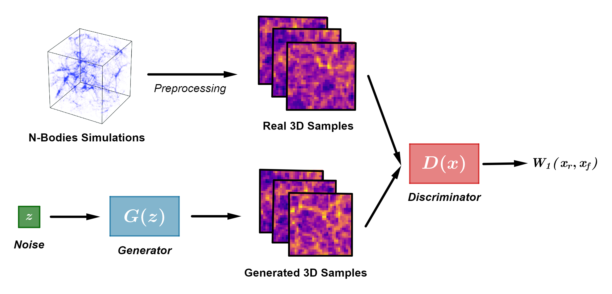
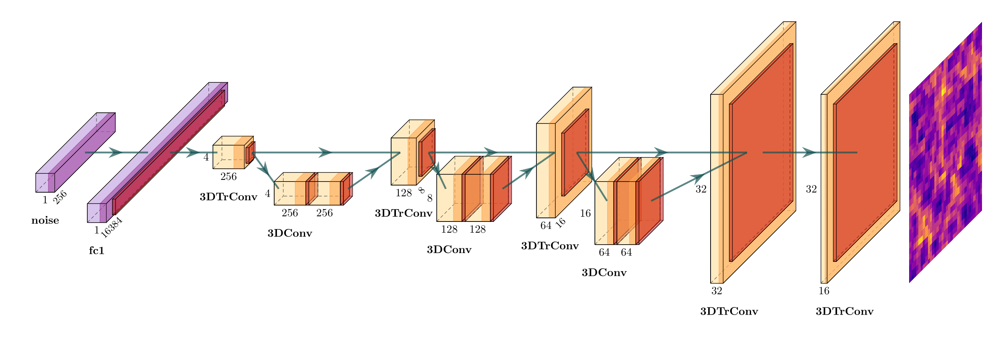
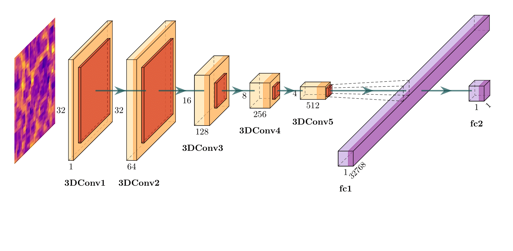
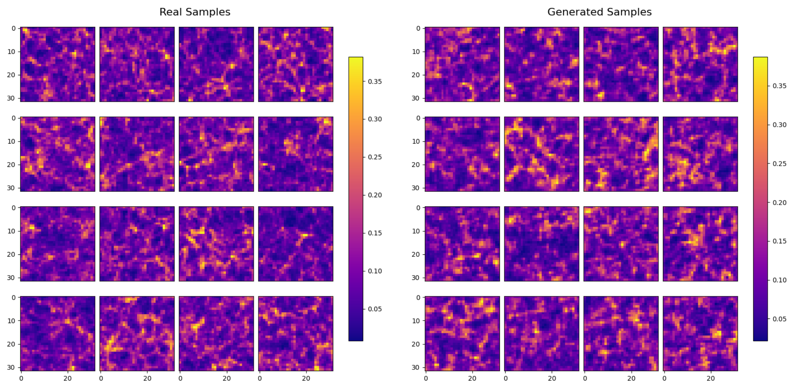
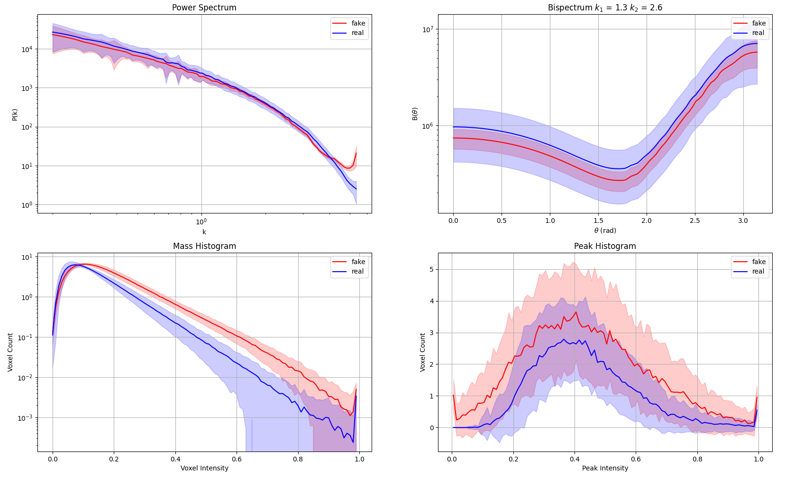

# DCWGAN for LSS Generation

Project on a Wasserstein Generative Adversarial Network for LSS Cosmology deep field generations for the Neural Networks and Deep Learning Course year 2023-2024

 **Processing pipeline**

  

**Generator**

  

**Discriminator**

  

**Results**

  

  

